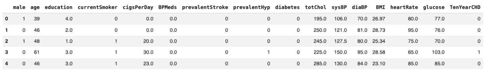
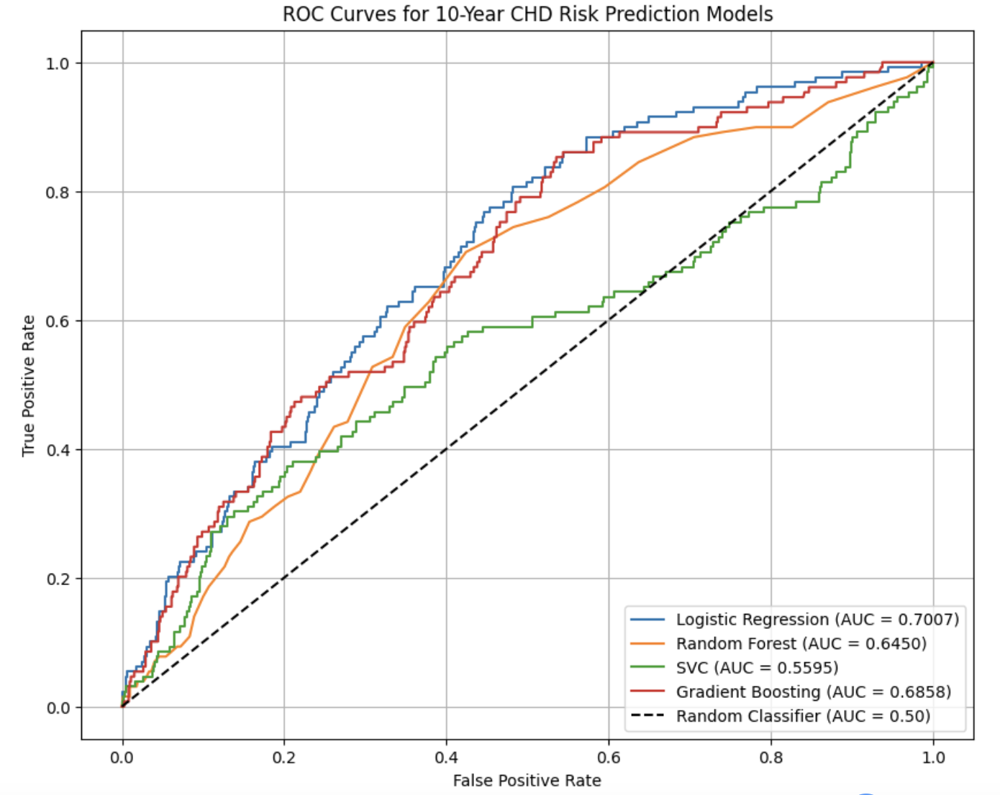
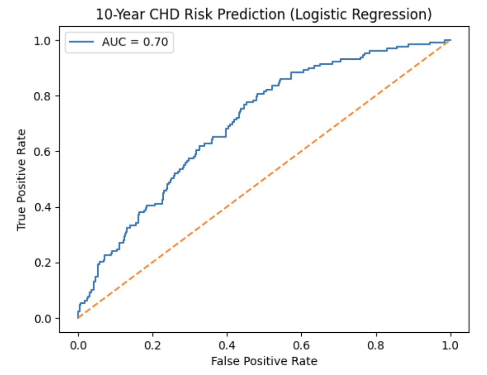
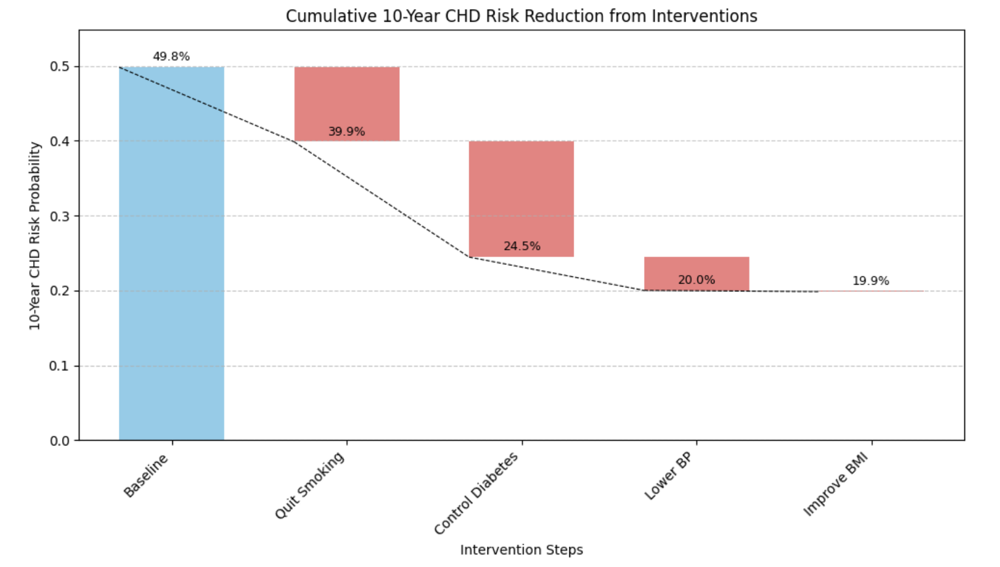

#  **Lifestyle-Enhanced AI for 10-Year CHD Risk**

## **1\. Abstract**

Cardiovascular disease (CVD) remains the leading cause of death worldwide, responsible for approximately 17.9 million deaths annually, with coronary heart disease (CHD) accounting for a substantial portion (World Health Organization, 2023). Despite extensive epidemiological research and the availability of validated clinical risk scores, many individuals remain unaware of their long-term cardiovascular risk or how modifiable lifestyle factors contribute to disease progression.

Traditional clinical risk assessment tools, such as the Framingham Risk Score, estimate 10-year CHD risk using fixed statistical equations derived from population-level cohorts. Although these models are widely used and clinically validated, they provide static risk estimates and do not support intuitive, interactive exploration of how changes in individual lifestyle factors may influence predicted risk. As a result, they are limited in their ability to support patient education and personalized risk awareness.

In this study, a Logistic Regression model was developed that achieved an ROC-AUC of 0.70, performing consistently with established clinical standards. The model also supports an interactive platform that allows users to visualize how modifiable lifestyle factors can shift predicted risk.

**Objective:**  
The objective of this project is to apply machine learning techniques to predict 10-year CHD risk using real, de-identified clinical data while allowing interactive, user-driven simulations of lifestyle-related inputs (e.g., smoking status, BMI, blood pressure). These simulations are designed to improve interpretability and educational value by showing how the predictive model responds to changes in modifiable risk factors.

## **2\. Methods**

### **2.1 Data Source**

Data was obtained from the Framingham Heart Study public dataset, available via the HuggingFace repository. The dataset contains clinical and demographic information for 4,238 participants, aged 30-74 years, with follow-ups for 10-year CHD outcomes.

*Figure 1: Representative Subset of the Framingham Heart Study Dataset.*

### **2.2 Data Cleaning** 

Missing values were handled via median imputation for continuous variables and mode imputation for categorical variables to reflect realistic clinical deployment conditions where full patient records are often unavailable (Heymans & Twisk, 2022). This approach ensured that the model remained robust even when faced with the incomplete datasets typical of emergency or community health settings. The final feature set consisted of: age, male, currentSmoker, diabetes, totChol, sysBP, BPMeds, BMI.

### **2.3 Model Choice**

To ensure methodological rigor, multiple supervised learning algorithms were evaluated for 10-year CHD risk prediction:

* Logistic Regression (L2 regularized)  
* Random Forest  
* Support Vector Machine (RBF kernel)  
* Gradient Boosting (tree-based boosting)

All models were trained using identical preprocessing pipelines (median imputation, feature scaling where required, and an 80/20 train-test split). Performance was evaluated using ROC-AUC, a threshold-independent metric appropriate for imbalanced biomedical classification problems.

*Figure 2: ROC Curves for 10-Year CHD Risk Prediction Models*

The final model was Logistic Regression with L2 regularization. The decision was based on the following technical considerations:

* Major cardiovascular risk estimation frameworks including the Framingham Risk Score and ASCVD Pooled Cohort Equations are fundamentally logistic regression–based models  
* Achieved the highest ROC-AUC on the test set  
* Minimizes overfitting risk in a moderate-sized dataset  
* Produces stable probabilistic outputs suitable for risk communication  
* Supports additive, stepwise visualization required for interactive lifestyle simulation

### **2.4 Model Development**

The processed dataset was partitioned into an 80% training set and a 20% hold-out test set to ensure an unbiased evaluation of model performance. We implemented a machine learning pipeline using Logistic Regression with L2 regularization, chosen for its balance of predictive power and clinical interpretability. The development workflow included:

* Feature Engineering: Categorical encoding for non-numerical variables and StandardScaler normalization for all continuous features (Age, BMI, Blood Pressure, Cholesterol) to ensure uniform weight distribution.

* Training & Evaluation: The model was trained to predict the probability of a 10-year CHD event, with performance validated on the test set using ROC-AUC and accuracy metrics.

### **2.5 Interactive Lifestyle Simulation**

The interactive lifestyle simulation designed for interpretability and educational exploration was developed in Colab using ipywidgets. Users can adjust modifiable features (smoking, BMI, blood pressure, diabetes/glucose) to observe changes in predicted 10-year CHD risk. Stepwise updates are reflected in a waterfall-style chart, where each bar shows the change in predicated risk for a single intervention while holding all other features constant. 

## **3\. Results**

### **3.1 Logistic Regression Performance**

*Figure 3: ROC Curve for a 10-Year CHD Risk Prediction model using Logistic Regression.*

The model achieved a ROC-AUC of approximately 0.70, consistent with reported performance of traditional Framingham-based risk models. Model coefficients offer interpretability, highlighting the relative influence of established cardiovascular risk factors. 

### **3.2 Explanation of ROC-AUC and Model Performance**

The Receiver Operating Characteristic \- Area Under the Curve (ROC-AUC) measures a model’s ability to discriminate between individuals who experience a CHD event and those who do not across all classification thresholds.

Formally, ROC-AUC represents the probability that the model assigns a higher predicated risk to a randomly selected individual who experiences CHD than to one who does not.

**Interpretation:**

* 0.5 → No better than random guessing  
* 0.60-0.70 → Weak discrimination  
* 0.70-0.80 → **Acceptable discrimination**  
* 0.80-0.90 → Strong discrimination

The achieved ROC-AUC of 0.70 aligns with the performance ceiling of traditional risk scores, which typically range from 0.70 to 0.78 in large-scale meta-analyses (Liu et al., 2024). In cardiovascular risk prediction, AUC values typically peak around 0.70-0.78 due to:

* Biological variability in disease progression  
* Measurement noise in clinical variables  
* Unobserved confounders (e.g., genetics, long-term behavior)

Large-scale clinical models such as the Framingham Risk Score and the ASCVD Pooled Cohort Equations report AUC values in the same range as the performance observed here. External validation studies show AUC values of approximately 0.71–0.76 for the Framingham Risk Score and 0.73–0.76 for the Pooled Cohort Equations when predicting 10-year cardiovascular risk. Therefore, an AUC of \~0.70 reflects performance consistent with established clinical standards rather than inherent model weakness.

### **3.3 Interactive Lifestyle Simulation**

The interactive simulation allows users to adjust modifiable risk factors and observe corresponding changes in predicted 10-year CHD risk. This enhances the model’s educational and practical value by illustrating how lifestyle changes may influence long-term cardiovascular risk.

### **3.4 Waterfall Visualization of Lifestyle Interventions**

To enhance interpretability, predicted risk changes from hypothetical lifestyle modifications are visualized using a waterfall-style chart. This chart presents a sequential view of how modifying individual risk factors affects the model’s predicted 10-year CHD probability, starting from a baseline patient profile and applying one intervention at a time.

*Figure 4: Sequential Impact of Lifestyle Interventions on 10-Year CHD Risk.*

Note: Due to the model reflecting real-world population patterns, certain simulations (e.g., extremely low BMI or blood pressure) may show a marginal increase in predicted risk. These counterintuitive results are consistent with clinical observations of frailty-related risk in older populations, as analyzed further in the Discussion.

This waterfall chart illustrates the additive effects of modifiable risk factors for a high-risk profile (55-year-old male, current smoker, with diabetes and hypertension). Starting from a baseline risk of 39.9%, the visualization tracks the marginal reduction in predicted probability as specific health interventions (e.g., smoking cessation, blood pressure adjustments, BMI modification). Each bar reflects the change in predicated risk after modifying a single input variable while holding others constant. The final risk score of **19.9%** reflects the model's integrated prediction for the optimized profile.

It is important to note that this waterfall chart is meant to illustrate how the model behaves, not to show true cause-and-effect. The logistic regression model predicts risk based on a full patient profile, it’s not designed to estimate the direct impact of individual interventions.

So, the waterfall chart should be viewed as a transparent learning tool, and not a clinical recommendation system. It helps users see how the model responds to input changes and understand the limits of using predictive models to simulate step-by-step lifestyle improvements.

## **4\. Discussion**

This project shows that machine learning models trained on real-world clinical datasets can match the discrimination performance of traditional epidemiological risk scores while providing substantially greater interactivity. Rather than replacing established tools, the model functions as a computational extension of them, preserving comparable predictive accuracy while allowing users to dynamically explore how changes in input variables alter predicted 10-year cardiovascular risk.

The use of median imputation reflects realistic clinical deployment conditions, where missing laboratory or survey data are common. Designing the pipeline around incomplete data strengthens its practical applicability. While the overall predictive performance is similar to established scores such as Framingham-based models, the primary contribution of this work lies in usability and interpretability: users can visualize how modifiable lifestyle factors (blood pressure, BMI, cholesterol, smoking status) shift the model’s estimated risk in real time.

The interactive lifestyle simulation also reveals an important methodological constraint. Predictive models are correlational by construction; they learn statistical associations from population-level data and do not encode causal intervention effects. Consequently, the model may produce counterintuitive outputs, for example, predicting slightly higher risk after lowering blood pressure or BMI. This aligns with existing epidemiological research suggesting a U-shaped relationship between these factors and cardiovascular mortality. For instance, The Association Between BMI and Different Frailty Domains demonstrates that underweight individuals often face a higher risk due to physical frailty and a lack of functional reserve. Similarly, the Korea National Institute of Health found that achieving systolic blood pressure below 120 mmHg can increase the risk of adverse events, a phenomenon known as the 'J-curve' effect.

**Limitations & Future Improvements**  
A primary limitation is the use of the Framingham dataset, which is composed largely of individuals of European descent, potentially limiting the model's accuracy for more diverse populations (Govindaraju et al., 2010). Future work should incorporate multi-ethnic datasets to improve external validity and model fairness. 

Additionally, the lifestyle simulations are hypothetical projections rather than results from controlled clinical interventions. Future research could validate these predictions through longitudinal or real-world intervention studies. 

Finally, cardiovascular risk prediction is inherently probabilistic and constrained by unmeasured biological and environmental factors. Expanding feature inputs like genetic markers or social determinants of health could further enhance predictive precision.

## **5\. Conclusion**

An AI-derived 10-year CHD risk prediction model was developed using de-identified Framingham data. The logistic regression model achieved a ROC-AUC of 0.70, consistent with clinically validated cardiovascular risk scores. An interactive lifestyle simulation tool was implemented to visualize how modifiable behaviors may influence predicted long-term cardiovascular risk. While these interactive simulations provide significant educational value, it is important to note that they remain predictive rather than causal. Consequently, they should be used for risk visualization rather than prescribing specific medical treatments; future iterations of this work could incorporate causal machine learning to more accurately model the specific impact of lifestyle interventions (Sanchez et al., 2022). Ultimately, this project highlights the potential for interactive AI to transform static clinical data into a dynamic educational roadmap, empowering individuals to better understand and manage their cardiovascular health.

